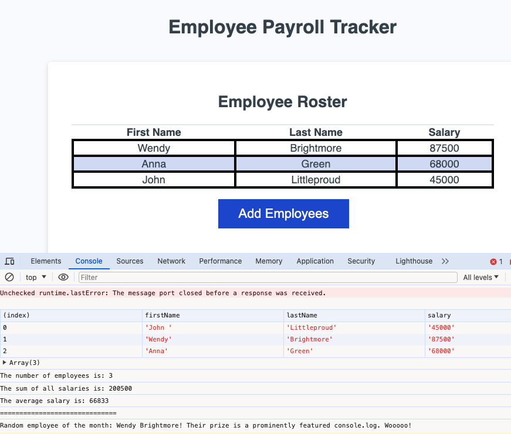

# Bootcamp Challenge 03 - JavaScript: Employee Payroll Tracker 

Coding bootcamp challenge to modify starter code in Javascript to allow an employee payroll manager to view and manage employee payroll data.

## Description

Challenge is to complete the code using Javascript techniques learned during Week 3 of the bootcamp, in particular the use of variables, comparison operators, arrays, loops/iteration, functions, objects and methods.

[User Story](#user-story) and [Acceptance Criteria](#acceptance-criteria) are below.

Also included below is my [Process & Learnings](#process-learnings) section.

## Usage

Site is [deployed on Github pages](https://roughnut.github.io/employee-payroll-tracker/ "linke to deployed employee payroll tracker site")

## User Story

```md
AS A payroll manager
I WANT AN employee payroll tracker
SO THAT I can see my employees' payroll data and properly budget for the company
```

## Acceptance Criteria

```md
GIVEN an employee payroll tracker
WHEN I click the "Add employee" button
THEN I am presented with a series of prompts asking for first name, last name, and salary
WHEN I finish adding an employee
THEN I am prompted to continue or cancel
WHEN I choose to continue
THEN I am prompted to add a new employee
WHEN I choose to cancel
THEN my employee data is displayed on the page sorted alphabetically by last name, and the console shows computed and aggregated data
```

## Screenshot



## Process & Learnings

1. `WHEN I click the "Add employee" button`  
`THEN I am presented with a series of prompts asking for first name, last name, and salary`

- Needed to use a `while (...)` loop with a boolean expression to check if the user wanted to continue adding employees after each new employee is added
- Also used `if (isNan(salary))` loop to check if the salary variable was a number - defaulted to 0 if not
- Interesting that when the salary is added to the `employeeDetails` object defined in `collectEmployees()`, it is converted to a string (and needs to be converted to a Number later)
- I did try `return employeeDetails` but that wasn't added to the `employees` array in the `trackEmployeeData` function
- Instead I defined `employeesArray` in `collectEmployeeData` and pushed each `employeeDetails` object to that array, then `return employeesArray` did the job  

2. `WHEN I finish adding an employee`  
`THEN I am prompted to continue or cancel`  

- Learned that `continue` is reserved in JS when I tried to use it in the boolean check for the user wanting to continue adding employees - used `continueAdding` instead

3. `displayAverageSalary` while not in the acceptance criteria, is in the challenge requirements - number of employees and their average salary needed to be logged to the console

- Needed template literal strings with number of employees and average salary
- Number of employees was a relatively simple `arr.length` method
- Average salary a bit trickier (didn't help the `salary` value was a string type)
- Defined a `totalSalary` variable of `Number` type equal to 0 and looped through `employeesArray` getting the `salary` value, converting it to a Number using `Number(employeesArray[i].salary)`, then using the addition assignment operator to add it to `totalSalary`
- To calculate the average salary, I used `Math.round(totalSalary / arr.length)`

4. Lastly, a `gerRandomEmployee` function needed to select an employee at random and log their full name (first and last) to the console

- Used `Math.floor(Math.random() * arr.length)` to get a `randomEmployeeNumber` to select an employee from the `employees` array
- Used template literals to insert the key-value pairs from the object into the console log
- `${arr[randomEmployeeNumber].firstName}` joined to `${arr[randomEmployeeNumber].lastName}`